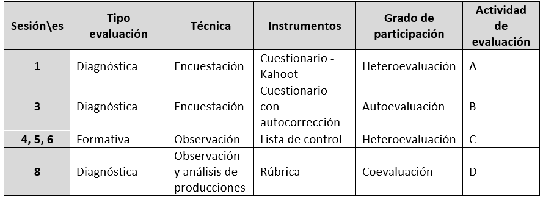

#Práctica 4

##Asignatura: Procesos educativos

###Criterio 5. Tecnología 4ESO

Realizar el montaje de circuitos electrónicos analógicos sencillos, analizando y describiendo sus componentes elementales, así como sus posibles aplicaciones y previendo su funcionamiento a través del diseño previo, usando software específico y la simbología normalizada para comprobar su utilidad en alguna situación tecnológica concreta o en un prototipo.

Durante la situación de aprendizaje se utilizarán tanto la evaluación formativa, donde el alumnado irá recibiendo retroalimentaciones de su proceso de aprendizaje para poder ir haciendo los ajustes necesarios en pro de conseguir el mayor grado de asimilación de los contenidos. Además, el docente podrá adaptar la metodología y los contenidos.

Por otro lado, se plantean varias sesiones con evaluación diagnóstica: Kahoot, listas de control y observación de los proyectos que cada grupo presentará en la sesión final.

Desde el punto de vista del alumnado y su participación en el sistema de evaluación, será distinta en las diferentes sesiones que se han planteado, por un lado tendremos actividades con autoevaluación, otras con hetero evaluación y finalmente de coevaluación ya que en el proyecto final se plantea una rúbrica para que alumnado se valore entre grupos.

A continuación se muestra una tabla con el sistema de evaluación propuesto:

